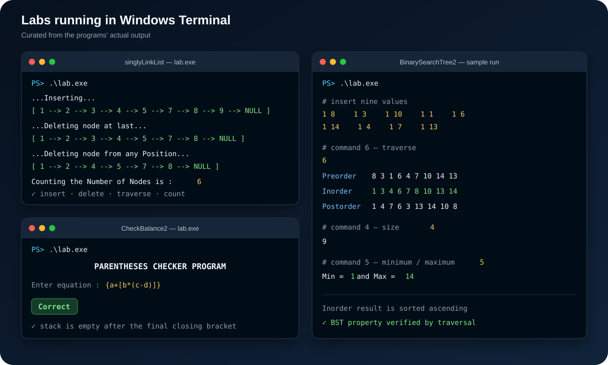
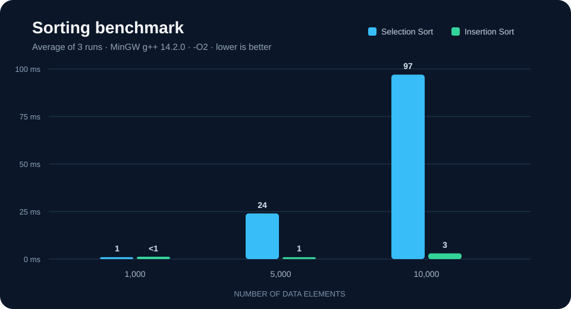
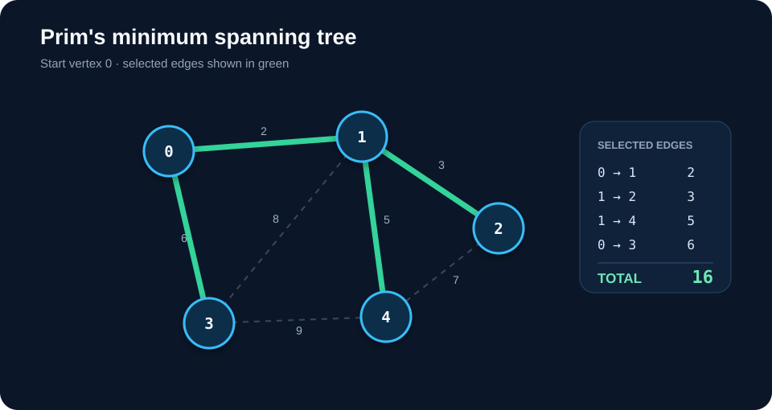

# Data Structures and Algorithms Labs


รวมงานแลปวิชา **04-061-212 Data Structures and Algorithms Laboratory** ที่ลงมือเขียนโครงสร้างข้อมูลและอัลกอริทึมพื้นฐานด้วย C++ ตั้งแต่ linked list และ stack ไปจนถึง binary search tree, sorting และ minimum spanning tree

## Lab overview

| Lab | แนวคิดที่ฝึก | สิ่งที่โปรแกรมทำ |
|---|---|---|
| [Singly Linked List](singlyLinkList/main.cpp) | Node, pointer, traversal | เพิ่ม ลบ ค้นหา นับ และทำลายลิสต์ |
| [Doubly Linked List](DoublyLinkedList/main.cpp) | Previous/next links | เพิ่มและลบโหนดตามตำแหน่ง เดินดูข้อมูลและค้นหา |
| [Stack — Check Balance](CheckBalance2/main.cpp) | LIFO stack | ตรวจความสมดุลของวงเล็บ `()`, `[]` และ `{}` |
| [Binary Search Tree](BinarySearchTree2/main.cpp) | Tree operations | Insert, remove, search, size, min/max และ traversal 3 แบบ |
| [Sorting](Sort/main.cpp) | Algorithm comparison | เปรียบเทียบ Selection Sort และ Insertion Sort ด้วยข้อมูลชุดเดียวกัน |
| [Graph — Minimum Spanning Tree](GraphMST/main.cpp) | Graph, priority queue | หา MST ด้วย Prim's algorithm และคำนวณน้ำหนักรวม |

## โปรแกรมตอนรันจริง

ภาพ terminal-style ด้านล่างสรุปผลจากการรันโปรแกรมจริง ช่วยให้เห็นทั้งการเปลี่ยนแปลงของ linked list, การตรวจวงเล็บด้วย stack และ traversal ของ Binary Search Tree โดยไม่ต้องเปิดแต่ละไฟล์ก่อน



ในส่วน BST ค่า `8, 3, 10, 1, 6, 14, 4, 7, 13` ถูก insert ตามลำดับ และผล Inorder เรียงจากน้อยไปมาก จึงแสดงคุณสมบัติของ Binary Search Tree ได้ชัดเจน

## ผลการทดลอง

### Sorting benchmark

โปรแกรมสร้างข้อมูลแบบผสม: ครึ่งแรกเรียงจากมากไปน้อยและครึ่งหลังเป็นเลขสุ่ม จากนั้นคัดลอกข้อมูลให้ทั้งสองอัลกอริทึมใช้ input ชุดเดียวกัน ผลด้านล่างเป็นค่าเฉลี่ยจากการรัน 3 ครั้งด้วย MinGW g++ 14.2.0 และ `-O2`



ที่ข้อมูล 10,000 ตัว Selection Sort ใช้เวลาประมาณ **97 ms** ส่วน Insertion Sort ใช้ประมาณ **3 ms** สำหรับรูปแบบข้อมูลนี้ เวลาจริงขึ้นอยู่กับเครื่องและ compiler; ดูวิธีทดลองและผลฉบับเต็มได้ที่ [Experiment results](docs/RESULTS.md)

### Minimum spanning tree example



จากกราฟตัวอย่าง 5 vertices และ 7 edges โปรแกรมเลือก 4 edges ที่เชื่อมทุก vertex โดยมีน้ำหนักรวมต่ำสุดเท่ากับ **16**

## วิธี build และรัน

แต่ละโฟลเดอร์เป็นโปรแกรมแยกกัน เปิด `main.cpp` ด้วย Code::Blocks แล้ว Build & Run ได้ทันที หรือใช้ g++ จาก command line:

```sh
cd GraphMST
g++ -std=c++11 -O2 -Wall -Wextra main.cpp -o lab
./lab
```

บน Windows PowerShell ใช้ `.\lab.exe` แทน `./lab`

Sorting lab รับจำนวนข้อมูลสำหรับทดลองได้ตั้งแต่ 1 ถึง 1,000,000 ตัว หากไม่ระบุจะใช้ค่าเดิม 1,000,000 ตัว:

```sh
cd Sort
g++ -std=c++11 -O2 main.cpp -o sort_lab
./sort_lab 10000
```

> Selection Sort มีเวลาเติบโตระดับ O(n²) การรันกับข้อมูล 1,000,000 ตัวจึงอาจใช้เวลานานมาก แนะนำให้เริ่มทดลองที่ 1,000–10,000 ตัว

## Complexity at a glance

| Operation / algorithm | Average time | Extra space |
|---|---:|---:|
| Linked-list search | O(n) | O(1) |
| Stack push / pop | O(1) | O(1) |
| BST search / insert | O(log n) โดยเฉลี่ย, O(n) กรณีแย่สุด | O(1) สำหรับการทำงานแบบวนซ้ำ |
| Selection Sort | O(n²) | O(1) |
| Insertion Sort | O(n²) โดยเฉลี่ย, O(n) กรณีข้อมูลเรียงอยู่แล้ว | O(1) |
| Prim's MST | O((V + E) log V) ด้วย priority queue | O(V + E) |

## งานกลุ่ม

Lab Graph, Binary Search Tree และ Sorting ทำร่วมกันโดย:

- Phuriphat Malison
- Nawadon Srikhao
- Chotiphat Suwannawong
